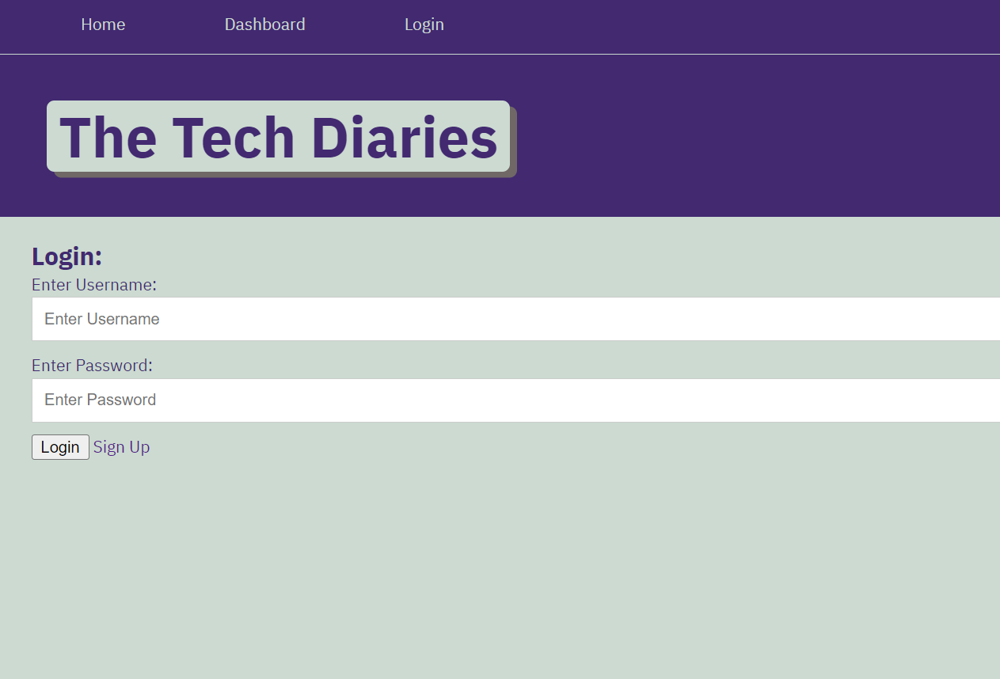
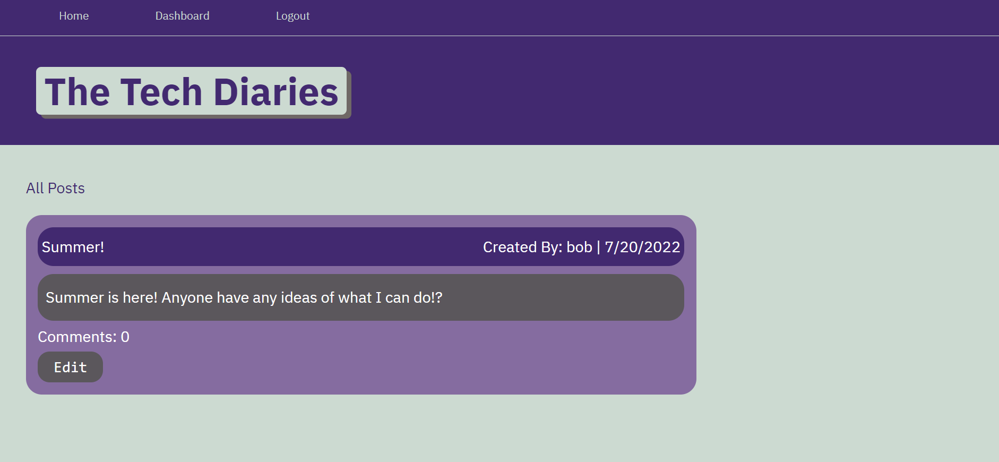
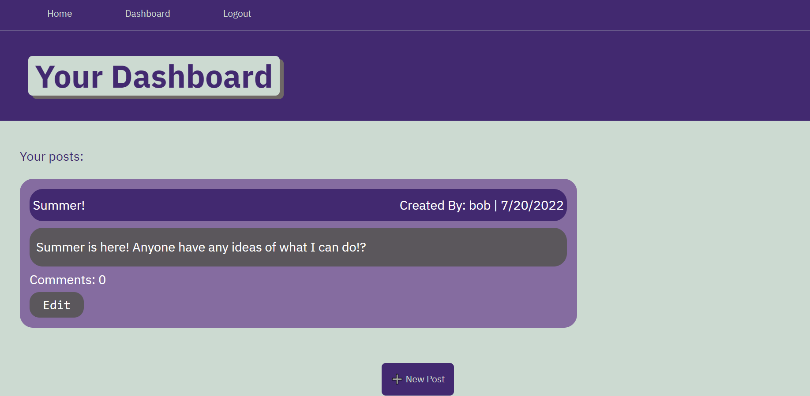

# Tech-Diaries

    
## Table of Contents
-[Description](#description)<br/>
-[Installation](#installation)<br/>
-[Usage](#usage)<br/>
-[License](#license)<br/>
-[Contribution](#contribution)<br/>
-[Screenshots](#screenshots)<br/>
-[Heroku](#heroku)<br/>
-[License](#license)<br/>
-[Questions](#questions)<br/>
    
## Description
This is a website where developers can publish a blog post and comment on other developers’ posts as well!

## Installation
Clone the repo from github, then run npm i in command line.

## Usage
To run the program, use the command:
```sh
npm start
```

## Contribution
Paige Caiozzo

## Screenshots




## Heroku
Click here to open deployed app: [Tech Diaries]( https://tech-blog33.herokuapp.com/)

## License
  [](http://choosealicense.com/licenses/mit/)

## Questions
Email: [paigecaiozzo@gmail.com](mailto:paigecaiozzo@gmail.com)
Github: [pcaiozzo](https://github.com/pcaiozzo)
